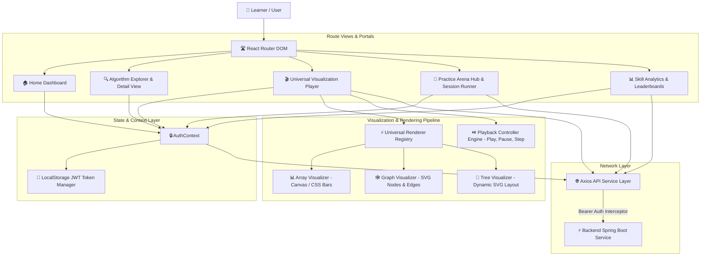

# 🎨 CodeLoom DSA Visualizer — Web Client

<div align="center">

  <a href="https://git.io/typing-svg">
    
  </a>

  <br/>
  <br/>

  
  
  
  
  
  

  <br/>

  > **Next-Generation Interactive Algorithm Learning & Practice Platform**  
  > *Experience step-by-step visual execution, custom array/graph data generators, live code execution arenas, and gamified skill progression.*

</div>

---

## 🌟 Feature Highlights

<table width="100%">
  <tr>
    <td width="33%" align="center">
      <h3>🎬 Universal Visualizer</h3>
      <p><code>⚡ REAL-TIME ANIMATIONS</code></p>
      <p>Interactive playback bar with speed adjustment (0.25x-4x), step controls, state highlights & multi-structure SVG/Canvas rendering.</p>
    </td>
    <td width="33%" align="center">
      <h3>🎯 Practice Arena</h3>
      <p><code>🔥 6 PRACTICE MODES</code></p>
      <p>Split-pane workspace, multi-language code editor (Java, Python, JS, C++), automated daily challenges & instant evaluation.</p>
    </td>
    <td width="33%" align="center">
      <h3>📊 Skill Analytics</h3>
      <p><code>🏆 GAMIFIED PROGRESS</code></p>
      <p>GitHub-style contribution heatmap grid, custom SVG skill spider radar, XP level progression & global leaderboards.</p>
    </td>
  </tr>
</table>

---

## 🏛️ Frontend Client Architecture



---

## ⚡ Core Engine Modules

<details open>
<summary><b>🎬 1. Universal Interactive Visualization Player (<code>/visualizer/:slug</code>)</b></summary>
<br/>

- **Execution Controls**: Pause, Play, Step Forward, Step Backward, Speed Slider (`0.25x` to `4.0x`).
- **Structure-Aware Renderers**:
  - **Arrays**: Dynamic bar height rendering with color-coded operational states (`COMPARISON`, `SWAP`, `PIVOT`, `SORTED`).
  - **Graphs**: SVG node placement with highlighted edge paths for BFS, DFS, and Dijkstra shortest path traversals.
  - **Trees**: Interactive tree node rendering with dynamic depth offsets.
- **Custom Data Generators**: Generate custom arrays, random graph topologies, or pre-configured target problem inputs.
</details>

<details open>
<summary><b>🎯 2. Practice Arena & Session Runner (<code>/practice</code>)</b></summary>
<br/>

- **6 Practice Modes**: Quick Practice, Timed Sprint, Topic Focus, Streak Builder, Random Shuffle, Daily Challenge.
- **Split-View Session Runner**: Left pane problem spec & test cases, right pane multi-language code editor.
- **Evaluation Feedback**: Live submission evaluation, execution results, test case breakdown, and celebration modal on goal completion.
</details>

<details open>
<summary><b>📊 3. Gamification & Analytics Dashboard (<code>/analytics</code>)</b></summary>
<br/>

- **Contribution Heatmap**: GitHub-style activity grid mapping active practice sessions and submissions over time.
- **Skill Radar Chart**: Dynamic SVG spider radar mapping relative mastery across DSA categories.
- **XP & Streaks**: Live streak flame indicator, daily bonus multiplier, level advancement badge, and achievement trophies.
</details>

---

## 🛠️ Technology Stack

| Technology | Category | Usage & Purpose |
| :--- | :--- | :--- |
| **React 18.3** | UI Framework | Component-based SPA framework |
| **TypeScript 5.5** | Language | Strict type safety and interface contracts |
| **Vite 5.4** | Build Engine | Lightning-fast HMR and optimized production build |
| **TailwindCSS 3.4** | Design System | Responsive dark mode & glassmorphic UI components |
| **Lucide Icons** | Design Assets | Vector iconography |
| **Axios** | HTTP Client | Centralized REST client with automatic JWT token attachment |
| **Canvas & SVG** | Renderers | Dynamic high-performance step execution graphics |
| **Nginx Alpine** | Web Server | Production SPA static host & reverse proxy |

---

## 📂 Directory Architecture

<details>
<summary><b>🔍 Expand Folder Structure</b></summary>

```text
frontend/
├── dist/                      # Production build output
├── nginx.conf                 # Nginx SPA fallback configuration
├── public/                    # Static assets & favicon
└── src/
    ├── api/                   # Axios API service modules
    │   ├── apiClient.ts       # Central Axios instance with JWT interceptor
    │   ├── algorithmService.ts# Catalog & snapshot endpoints
    │   ├── analyticsService.ts# Activity stats & leaderboard APIs
    │   └── practiceService.ts # Practice arena & session runner APIs
    ├── components/            # Component Layer
    │   ├── algorithm/         # Detail views, multi-language snippets
    │   ├── analytics/         # Activity heatmap, SVG radar, badges
    │   ├── layout/            # Navbar, footer, main shell
    │   ├── practice/          # Daily challenge, split-view runner
    │   └── visualization/     # Array & Graph SVG renderers, controls
    ├── context/               # AuthContext & session providers
    ├── pages/                 # Route views (Home, Arena, Visualizer)
    └── types/                 # Interface definitions & DTO models
```
</details>

---

## 🚀 Quick Start Guide

### 1. Prerequisites
- **Node.js**: `20.x` or higher
- **npm**: `10.x` or higher

### 2. Installation & Local Setup

```bash
# Clone repository and navigate to frontend directory
cd frontend

# Install project dependencies
npm install

# Create environment configuration
echo "VITE_API_BASE_URL=http://localhost:8080/api/v1" > .env

# Launch Vite development server
npm run dev
```

Visit **`http://localhost:5173`** in your browser.

---

## 🐳 Docker Deployment

Build and run using the lightweight Nginx Alpine container:

```bash
# 1. Build production Docker image
docker build -t codeloom-frontend .

# 2. Run Nginx container
docker run -d -p 80:80 \
  -e VITE_API_BASE_URL=http://localhost:8080/api/v1 \
  --name dsa-frontend codeloom-frontend
```

Open **`http://localhost`** to access the web application.

---

## 📜 License

Distributed under the **MIT License**.
