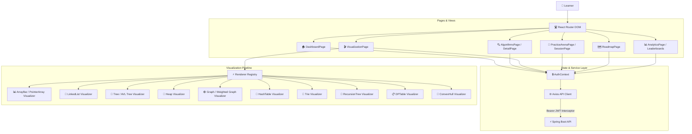

# 🧵 CodeLoom

### DSA Visualizer & Interactive Learning Playground

<div align="center">

  <a href="https://git.io/typing-svg">
    
  </a>

  <br/>
  <br/>

  [](https://react.dev/)
  [](https://www.typescriptlang.org/)
  [](https://vitejs.dev/)
  [](https://tailwindcss.com/)
  [](https://nginx.org/)
  [](https://www.docker.com/)
  [](LICENSE)

  <br/>

  > *Learn algorithms by watching them execute — step by step, state by state, with the actual data structure in front of you.*

</div>

---

## DSA hits different when you can actually see it.

You read:

```text
mid = left + (right - left) / 2
```

and understand the syntax. But understanding the algorithm is different.

Where is `left`?  
Why did `right` move?  
Why did this tree node balance itself?  
Why did the heap swap parent and child?  
Why did Dijkstra choose that node over the cheaper adjacent path?  
What *exactly* changed between step 7 and step 8?

DSA shouldn't feel like memorizing a PDF. **CodeLoom** exists to answer those questions visually.

Stop staring at pseudocode. Press play.

---

## Welcome to the playground 🧵

The goal of CodeLoom isn't just to "finish algorithms". The goal is to build genuine intuition.

```text
Learn
  ↓
Visualize
  ↓
Experiment
  ↓
Practice
  ↓
Track Progress
  ↓
Repeat
```

Understand the pointer. Watch the state change. Get it.

---

## VISUALIZATION

## Stop reading the algorithm. Watch it happen.

CodeLoom is **structure-aware**. We don't reduce every single algorithm to bar charts. Each data structure gets the visual abstraction that actually makes sense for how it works in memory.

### Structure-Aware Abstractions

- **Arrays & Sorting**: Color-coded element bars showing active comparison, swap, pivot, and sorted bounds.
  ```text
  [64]  [25]  [12]  [22]  [11]
  ```

- **Binary Search & Two Pointers**: Synchronized `LEFT`, `MID`, and `RIGHT` pointer markers tracking index bounds in real-time.
  ```text
  LEFT        MID             RIGHT
   ↓           ↓                ↓
  [11]  [22]  [25]  [37]  [42]  [58]  [71]
  ```

- **Singly & Doubly Linked Lists**: Node blocks linked by directional pointers showing head, tail, next, and prev mutations.
  ```text
  HEAD
   ↓
  [10] → [20] → [30] → NULL
  ```

- **Trees & AVL Rotations**: Hierarchy layout positioning nodes dynamically, highlighting parent-child traversal paths and balancing rotations.
  ```text
            [50]
           /    \
        [30]    [70]
  ```

- **Graphs (BFS, DFS, Dijkstra)**: Dynamic node-edge network layout representing visit states, traversal queues, and shortest path relaxation.
  ```text
  A ─── B
  │     │
  C ─── D
  ```

- **Heaps**: Dual synchronized representation linking array indices directly with binary tree hierarchy positions.
- **Tries**: Prefix tree branches with highlighted character search paths.
- **Recursion Trees**: Call stack visualization expanding stack frames depth-by-depth.
- **Dynamic Programming**: 2D DP table grid filling cell dependencies sequentially.
- **Geometry**: Coordinate plane sweep line & convex hull vertex connection boundaries.

---

## INTERACTION

## You're not watching a GIF. You're driving the algorithm.

CodeLoom gives you full control over algorithm execution. You dictate the pace, rewind steps, inspect variable state, and trace line-by-line execution.

### Controls & Feedback Loop
- ⏯️ **Play & Pause**: Start or freeze execution at any state.
- ⏭️ **Step Forward & Backward**: Jump step-by-step to inspect exact state changes.
- 🎚️ **Playback Speed Slider**: Smooth control from `0.25x` (deep inspection) to `4.0x` (fast execution).
- 📌 **State & Variable Highlights**: Active operational badge, highlighted code line, current pointers, and time/space complexity notes.

```text
Step 01 → Compare elements at index 2 and 3
Step 02 → Condition met: swap required
Step 03 → Swap values [25 ↔ 12]
Step 04 → Advance pointer
Step 05 → Sub-array sorted
```

---

## CUSTOM INPUT

## Break the demo. Make it yours.

Generic static examples only get you so far. CodeLoom lets you supply custom datasets to see how algorithms react to your own edge cases.

```text
Educational Example Dataset:
[64, 25, 12, 22, 11]

Customizable Input:
[91, 17, 42, 8, 63]
```

- **Customizable Input**: Input your own arrays, target search values, or custom graph nodes/edges.
- **Educational Example Datasets**: Curated pre-set data crafted to highlight specific algorithmic edge cases (e.g. reverse sorted arrays, unbalanced BSTs).

---

## LEARNING CONTENT

## Code is only half the lesson.

Not just code that works. Code you can actually see.

Every algorithm in CodeLoom bridges theory, visual intuition, and production code:

```text
Theory  →  Visualization  →  Code  →  Practice
```

For every algorithm, you get:
- **Intuition & Concept**: Why does this algorithm exist? When should you use it, and when should you avoid it?
- **Complexity Breakdown**: Best, average, and worst-case time complexity alongside space bounds.
- **Multi-Language Snippets**: Pseudocode, Java, Python, C++, and JavaScript implementations.
- **Step-by-Step Visual Execution**: Direct visual sync with code logic.

---

## PRACTICE ARENA

## Okay, visualization is cool. Now prove you get it.

Watching BFS is easy. Writing BFS at 2 AM with a blank editor? Different boss fight.

The **Practice Arena** (`/practice`) transitions you from passive observer to active solver.

### 6 Dedicated Practice Modes
- **Quick Practice**: Fast 3-problem sprint for daily habit building.
- **Timed Sprint**: Race against the clock (15m, 30m, 45m options).
- **Topic Focus**: Targeted drills by category (Trees, Graphs, DP, Sorting).
- **Streak Builder**: Daily streak maintenance challenges.
- **Random Shuffle**: Mixed interview-style problem set.
- **Daily Challenge**: Highlighted daily problem with bonus XP multipliers.

### Split-Pane Workspace (`/practice/session/:id`)
- Resizable problem description & sample test case navigator.
- Multi-language code editor (Java, Python, JavaScript, C++).
- Instant test case evaluation, submission runner, and celebration modal on completion.

---

## LEARNING ROADMAP

## Don't know what to learn next?

CodeLoom guides your progression with structured topic paths so you never feel lost.

```text
Onboarding Assessment
          ↓
Personalized Learning Path
          ↓
Topic Modules
          ↓
Visualization & Intuition
          ↓
Practice Arena
          ↓
Track Mastery
```

- **Prerequisite Unlocking**: Master fundamental structures (Arrays, Linked Lists) before unlocking advanced topics (Graphs, Segment Trees).
- **Topic Path Navigator**: Track completed modules, current recommendations, and overall category progress.

---

## GAMIFICATION

## Make progress visible.

You shouldn't need to wonder whether you're getting better. CodeLoom keeps the receipts.

- **XP & Levels**: Earn XP for completing visualization steps, daily challenges, and practice sessions.
- **Streaks & Protection**: Live flame streak counter with daily bonus multipliers and streak freeze protections.
- **Contribution Heatmap**: GitHub-style activity grid tracking daily practice consistency.
- **Topic Skill Radar**: Custom SVG spider chart detailing category mastery across DSA domains.
- **Achievements & Badges**: Unlockable trophies celebrating milestones.
- **Global Leaderboard**: Live community XP ranking.

---

## ARCHITECTURE

## Under the hood

Here is how the CodeLoom React client is structured internally:



---

## UNIVERSAL VISUALIZATION ARCHITECTURE

CodeLoom enforces a fundamental architectural rule:

> **"The frontend does not invent algorithm state."**

All step execution states, pointer positions, node highlights, and array modifications are driven by backend state generators adhering to a strict contract:

```text
Database Contract  →  Input Schema  →  Generator Registry  →  Snapshot Steps  →  Renderer Registry  →  Structure-Aware Renderer
```

### Visualization Contract Interface
- **`generatorKey`**: Specifies backend algorithm generator strategy (e.g. `bubble-sort`, `bfs`, `avl-tree`).
- **`rendererKey`**: Maps snapshot payload directly to registered frontend renderer component (e.g. `array`, `graph`, `tree`, `dp-table`).
- **`inputSchema`**: JSON schema validating custom inputs before submission.
- **`stepSchema`**: Snapshot schema specifying highlighted elements, current pointers, and step explanation text.

---

## TECH STACK

| Technology | Version | Usage & Role in Project |
| :--- | :--- | :--- |
| **React** | `^18.3.1` | Component-driven UI application framework |
| **TypeScript** | `~5.7.2` | Strict end-to-end type safety and DTO contracts |
| **Vite** | `^5.4.11` | Build engine, fast HMR, and production bundler |
| **TailwindCSS** | `^3.4.17` | Utility-first CSS styling and dark theme system |
| **Lucide React** | `^0.475.0` | Modern vector icon library |
| **Axios** | `^1.7.9` | Promise-based HTTP client with JWT interceptors |
| **React Router** | `^6.28.2` | Declarative client-side routing |
| **Vitest** | `^2.1.8` | Unit and component testing runner |
| **Nginx** | `Alpine` | Production static asset web server and proxy |
| **Docker** | `24+` | Containerization and environment isolation |

---

## PROJECT STRUCTURE

```text
frontend/
├── Dockerfile                 # Multi-stage Nginx container configuration
├── nginx.conf                 # Production Nginx SPA fallback configuration
├── package.json               # Manifest scripts and dependency versions
├── vite.config.ts             # Vite build & Vitest test runner configuration
└── src/
    ├── api/                   # Axios API service clients
    │   ├── apiClient.ts       # Central Axios instance with JWT interceptor
    │   ├── algorithmService.ts# Catalog & snapshot fetchers
    │   ├── analyticsService.ts# Activity, streak & leaderboard APIs
    │   └── practiceService.ts # Arena session & submission endpoints
    ├── components/            # Reusable UI component modules
    │   ├── algorithm/         # Detail panels, code snippet tabs
    │   ├── analytics/         # Activity heatmap, SVG skill radar
    │   ├── layout/            # Navbar, footer, layout shell
    │   ├── practice/          # Daily challenge, split-view session runner
    │   ├── ui/                # Buttons, modals, cards, badges
    │   └── visualization/     # Canvas & SVG visualizers, RendererRegistry
    ├── context/               # AuthContext & global state providers
    ├── pages/                 # Route page components
    ├── routes/                # Protected and public route guards
    ├── types/                 # TypeScript DTO models & contract definitions
    └── utils/                 # Storage helpers, date formatters
```

---

## QUICK START

### Prerequisites
- **Node.js**: `20.x` or higher
- **npm**: `10.x` or higher

### 1. Installation

```bash
# Clone repository
git clone https://github.com/Sukhankar/DSA-VISUALIZER-FRONEND.git
cd DSA-VISUALIZER-FRONEND

# Install dependencies
npm install
```

### 2. Environment Configuration

Create a `.env` file in the root of the `frontend` directory:

```env
VITE_API_BASE_URL=http://localhost:8080/api/v1
```

### 3. Launch Development Server

```bash
npm run dev
```

Open **`http://localhost:5173`** in your browser.

### 4. Build & Preview

```bash
# Type check and build production bundle into dist/
npm run build

# Preview production build locally
npm run preview

# Run Vitest unit tests
npm run test
```

---

## DOCKER DEPLOYMENT

To build and run the frontend using Docker with Nginx Alpine:

```bash
# 1. Build Docker image
docker build -t codeloom-frontend .

# 2. Run Nginx container
docker run -d -p 80:80 \
  -e VITE_API_BASE_URL=http://localhost:8080/api/v1 \
  --name dsa-frontend codeloom-frontend
```

Access the application at **`http://localhost`**.

---

## DEVELOPMENT WORKFLOW

When adding a new algorithm or visualization renderer to CodeLoom:

```text
Backend Algorithm Contract
            ↓
Define Snapshot Schema
            ↓
Register Generator (Backend)
            ↓
Add Renderer Component to RendererRegistry.ts
            ↓
Run Step Conformance & Unit Tests
```

New algorithms rely on backend contracts and `rendererKey` mapping in `RendererRegistry.ts` rather than hardcoded slug conditional checks.

---

## DESIGN PHILOSOPHY

## Built for intuition, not just completion.

1. **See state, not just output**: Understanding how data moves in memory builds long-term intuition.
2. **Understand why, not just what**: Step explanations connect code statements directly with visual pointer movement.
3. **Experiment instead of memorizing**: Custom data inputs let learners break assumptions and explore edge cases.
4. **Practice immediately after learning**: The Practice Arena converts visual understanding into coding execution.
5. **Track progress over time**: Gamified feedback loops keep learners consistent.

---

## ROADMAP STATUS

### 🧵 Universal Visualization Engine

- [x] Structure-aware renderers (`array`, `pointer-array`, `linked-list`, `tree`, `heap`, `graph`, `dp-table`, `trie`, `recursion-tree`, `geometry`)
- [x] Centralized `RendererRegistry` mapping contract keys to visual components
- [x] Input schema configuration panels for custom datasets
- [x] Step timeline runner with playback speed controls
- [x] Split-pane Practice Arena session workspace
- [x] Gamified streak, XP ledger, SVG skill radar & heatmap analytics

---

## CONTRIBUTING

Contributions are welcome! If you want to add a new renderer family or improve existing visualizers:

1. Fork the repository
2. Create your feature branch (`git checkout -b feature/amazing-renderer`)
3. Commit your changes (`git commit -m 'feat: add new trie visualizer animation'`)
4. Run tests (`npm run test`) and build check (`npm run build`)
5. Push to the branch (`git push origin feature/amazing-renderer`)
6. Open a Pull Request

---

## LICENSE

Distributed under the **MIT License**. See `LICENSE` for details.
