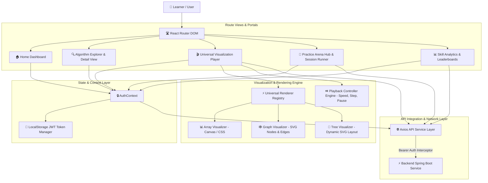

# 🎨 CodeLoom DSA Visualizer — Frontend Web Client

<div align="center">


<br/>

> **Interactive Algorithm Visualization, LeetCode-Style Practice Workspace & Gamified Learning Platform**  
> *Empowering developers to visualize Data Structures & Algorithms step-by-step with real-time execution controls, code playgrounds, practice arenas, and skill analytics.*

</div>

---

## 💡 Overview

**CodeLoom DSA Visualizer Frontend** is a modern, high-performance single-page web application (SPA) built with **React 18**, **TypeScript**, **Vite**, and **TailwindCSS**. It provides step-by-step interactive algorithm animations, a split-pane practice arena with multi-language code editing, interactive SVG charts, and streak/XP analytics.

---

## 🏛️ Frontend Client Architecture



---

## ⚡ Key Modules & Experience Features

### 1. 🎬 Universal Interactive Visualization Player (`/visualizer/:slug`)
- **Step Playback Controls**: Full control over execution with Play, Pause, Step Forward, Step Backward, and variable playback speed slider (0.25x to 4.0x).
- **Structure-Aware Renderers**:
  - **Array Visualizer**: Dynamic element bar charts with active highlight states for comparisons, swaps, pivots, and sorted ranges.
  - **Graph Visualizer**: Dynamic SVG graph layout rendering node selection, edge traversal paths, and shortest-path animations (BFS, DFS, Dijkstra).
  - **Tree Visualizer**: Smooth node layout positioning for binary search trees and heap structures.
- **Custom Input Generators**: Generate random data arrays, custom graph node/edge configurations, or pre-configured target inputs.

### 2. 🎯 Practice Arena Hub & Session Runner (`/practice`)
- **Interactive Practice Modes**:
  - **Daily Challenge**: Highlighted algorithm problem with XP multipliers.
  - **Quick Practice**: Fast 3-problem quick sprint.
  - **Timed Sprint**: Race against the clock (15m, 30m, 45m).
  - **Topic Focus**: Targeted category sessions (Trees, Dynamic Programming, Graphs).
- **Split-Pane Session Workspace (`/practice/session/:id`)**:
  - Resizable split-view problem navigator & multi-language code editor (Java, Python, JavaScript, C++).
  - Instant test case evaluation runner, submission feedback, and celebration modals.

### 3. 📊 Gamification & Analytics Portal (`/analytics`)
- **GitHub-Style Heatmap**: Visual contribution grid tracking daily practice sessions and completed algorithm challenges.
- **Topic Skill Radar**: Custom SVG spider chart depicting category mastery levels across DSA domains.
- **Streak & XP Progress**: Dynamic flame indicator, level advancement cards, XP ledger, and achievement trophy badges.
- **Global Leaderboard**: Live ranking of top community coders by XP earned.

---

## 🛠️ Technology Stack

| Library / Tool | Category | Usage & Purpose |
| :--- | :--- | :--- |
| **React 18** | UI Framework | Component-driven user interface architecture |
| **TypeScript 5** | Language | End-to-end strict type safety & DTO contracts |
| **Vite 5** | Build Tool | Ultra-fast HMR and optimized production bundling |
| **TailwindCSS & CSS3** | Styling | Responsive layout utilities & dark glassmorphism design |
| **Lucide React** | Icons | Crisp vector iconography |
| **Axios** | HTTP Client | Request/Response interceptors & JWT auth management |
| **Canvas & Dynamic SVG** | Rendering | Real-time algorithmic visualizer drawing engines |
| **Nginx Alpine** | Production Web Server | SPA routing fallback & API reverse proxying |

---

## 📁 Directory Architecture

```text
src/
├── api/                   # Axios HTTP services & endpoint interfaces
│   ├── apiClient.ts       # Central Axios instance with JWT auth header interceptor
│   ├── algorithmService.ts# Algorithm catalog & visualization snapshot fetcher
│   ├── analyticsService.ts# User activity stats, streak, heatmap & leaderboard APIs
│   └── practiceService.ts # Session runner, mode setup & submission endpoints
├── components/            # UI Component Architecture
│   ├── algorithm/         # Detail views, snippet renderers, code tab panels
│   ├── analytics/         # Activity heatmap grid, SVG skill radar, streak cards
│   ├── layout/            # Navigation header, sidebar, app container layout
│   ├── practice/          # Daily challenge banner, mode picker, workspace split-pane
│   ├── ui/                # Buttons, cards, modals, dropdowns, indicators
│   └── visualization/     # Array visualizer, graph SVG visualizer, playback bar
├── context/               # Global state providers (AuthContext, JWT storage)
├── pages/                 # Main route views (Home, Algorithms, Visualizer, Arena, Analytics)
├── types/                 # TypeScript DTO models & UI state declarations
└── utils/                 # Storage helpers, date formatters, state helpers
```

---

## 🚀 Quick Start (Local Development)

### 1. Install Dependencies
```bash
npm install
```

### 2. Configure Environment Variables
Create a `.env` file in the root of the `frontend` directory:
```env
VITE_API_BASE_URL=http://localhost:8080/api/v1
```

### 3. Launch Development Server
```bash
npm run dev
```
Open **`http://localhost:5173`** in your browser.

---

## 🐳 Production Build & Docker Setup

### Manual Build
To generate static production bundle in `dist/`:
```bash
npm run build
```

### Docker Container Deployment
Build and run the Nginx SPA container:

```bash
# 1. Build Container Image
docker build -t codeloom-dsa-frontend .

# 2. Run Nginx Container
docker run -d -p 80:80 \
  -e VITE_API_BASE_URL=http://localhost:8080/api/v1 \
  --name dsa-frontend codeloom-dsa-frontend
```

Access the application at **`http://localhost`**.

---

## 📜 License

Distributed under the **MIT License**.
