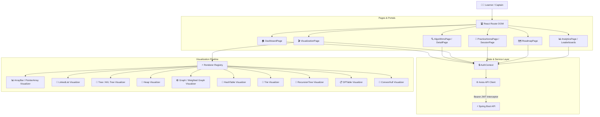

# 🏴‍☠️ CodeLoom — The Grand Line of DSA Visualizers

### Interactive Algorithm Playground & Code Execution Arena

<div align="center">

  <a href="https://git.io/typing-svg">
    
  </a>

  <br/>
  <br/>

  [](https://react.dev/)
  [](https://www.typescriptlang.org/)
  [](https://vitejs.dev/)
  [](https://tailwindcss.com/)
  [](https://nginx.org/)
  [](https://www.docker.com/)
  [](LICENSE)

  <br/>

  > *Set sail beyond static pseudocode — watch data structures mutate step-by-step, conquer coding practice arenas, and claim your place on the global leaderboard.*

</div>

---

## 🌊 The Voyage Begins: DSA hits different when you can actually see it.

Navigating the Grand Line of Data Structures & Algorithms is notorious for sinking devs in stormy seas of static text.

You read the navigation logbook:

```text
mid = left + (right - left) / 2
```

You get the syntax. But out on the open sea, understanding the algorithm in motion is a whole different beast.

- Where did `left` anchor?
- Why did `right` drift across the array?
- Why did that binary tree node execute an AVL rotation?
- Why did Dijkstra pick node `C` over the tempting short edge to `B`?
- What *exactly* shifted between step 7 and step 8?

CodeLoom wasn't built to be another boring PDF manual. It’s your visual Log Pose — designed to chart every pointer, memory mutation, and state transition in real-time.

Stop staring at dead pseudocode. Take the wheel and press play.

---

## ⚓ The Navigator's Loop: Welcome to the Playground 🏴‍☠️

The goal isn't to blindly copy-paste solutions to cross the sea. The goal is building unshakeable algorithmic intuition.

```text
Chart Course (Learn)
         ↓
Navigate Steps (Visualize)
         ↓
Test Stormy Waters (Experiment)
         ↓
Battle Problems (Practice)
         ↓
Claim Bounties & XP (Track Progress)
         ↓
Set Sail Again (Repeat)
```

Understand the pointer. Watch memory move. Conquer the Grand Line.

---

## 🗺️ VISUALIZATION

## Stop reading the logbook. Watch the voyage happen.

CodeLoom is **structure-aware**. We don't just dump bar charts and call it a day. Every data structure gets the exact visual abstraction needed to navigate its logic.

### Structure-Aware Abstractions Across the Seas

- **Arrays & Sorting (East Blue)**: Color-coded element bars detailing active comparisons, swaps, pivots, and sorted bounds.
  ```text
  [64]  [25]  [12]  [22]  [11]
  ```

- **Binary Search & Two Pointers**: Dual pointer anchors (`LEFT`, `MID`, `RIGHT`) tracking search space contraction in real-time.
  ```text
  LEFT        MID             RIGHT
   ↓           ↓                ↓
  [11]  [22]  [25]  [37]  [42]  [58]  [71]
  ```

- **Linked Lists**: Node islands connected by pointer links highlighting `HEAD`, `TAIL`, `NEXT`, and `PREV` pointer mutations.
  ```text
  HEAD
   ↓
  [10] → [20] → [30] → NULL
  ```

- **Trees & AVL Rotations**: Dynamic tree hierarchy rendering balance factors, parent-child traversals, and rotation transitions.
  ```text
            [50]
           /    \
        [30]    [70]
  ```

- **Graphs (BFS, DFS, Dijkstra)**: Node-edge networks displaying visit queues, edge traversal paths, and shortest path distance relaxations.
  ```text
  A ─── B
  │     │
  C ─── D
  ```

- **Heaps**: Synchronized dual representation linking array indices directly to binary heap tree positions.
- **Tries**: Prefix tree branches with highlighted character search paths.
- **Recursion Trees**: Call stack depth visualization unpacking stack frames state-by-state.
- **Dynamic Programming**: 2D DP matrix grid tracking cell dependencies step-by-step.
- **Geometry**: Coordinate plane sweep lines & convex hull perimeter connections.

---

## 🧭 INTERACTION

## You're not watching a GIF. You're captaining the ship.

You dictate the execution speed, rewind past moves, inspect memory variables, and trace code execution line by line.

### Captain's Controls
- ⏯️ **Play & Pause**: Freeze execution mid-algorithm at any point.
- ⏭️ **Step Forward & Backward**: Jump step-by-step to inspect exact state changes.
- 🎚️ **Playback Speed Slider**: Dial speeds from `0.25x` (deep inspection) to `4.0x` (full-speed execution).
- 📌 **State & Variable Highlights**: Active operational badge, highlighted code line, current pointers, and time/space complexity notes.

```text
Step 01 → Compare elements at index 2 and 3
Step 02 → Condition met: swap required
Step 03 → Swap values [25 ↔ 12]
Step 04 → Advance pointer
Step 05 → Sub-array sorted
```

---

## 🧪 CUSTOM INPUT

## Break the demo. Test your own custom waters.

Stock datasets are fine for basic training, but real pirates test their own edge cases.

```text
Educational Dataset:
[64, 25, 12, 22, 11]

Your Custom Waters:
[91, 17, 42, 8, 63]
```

- **Customizable Input**: Input custom arrays, target search elements, or graph edge configurations.
- **Educational Example Datasets**: Pre-configured datasets designed to showcase specific algorithmic edge cases (e.g. reverse sorted arrays, unbalanced BSTs).

---

## ⚔️ PRACTICE ARENA

## Visualization is cool. Now prove you can survive the battle.

Watching BFS from the deck is easy. Writing BFS at 2 AM with a blank editor? That's a real New World boss fight.

The **Practice Arena** (`/practice`) puts your coding skills to the test.

### 6 Practice Battle Modes
- **Quick Practice**: Fast 3-problem sprint to maintain daily coding momentum.
- **Timed Sprint**: Race against the countdown clock (15m, 30m, 45m).
- **Topic Focus**: Category-specific combat (Trees, Graphs, DP, Sorting).
- **Streak Builder**: Daily streak maintenance challenges.
- **Random Shuffle**: Mixed interview problem set.
- **Daily Challenge**: Highlighted daily problem with bonus XP multipliers.

### Split-Pane Battle Workspace (`/practice/session/:id`)
- Resizable problem description & test case runner.
- Multi-language code editor (Java, Python, JavaScript, C++).
- Instant test case evaluation, submission feedback, and celebration modal upon victory.

---

## 🏴‍☠️ BOUNTIES & GAMIFICATION

## Make progress visible. Claim your bounty.

You shouldn't need to guess if your skills are leveling up. CodeLoom keeps the receipts.

- **XP & Level Progression**: Earn XP for completing visualization steps, daily challenges, and practice arena submissions.
- **Streaks & Flame Multipliers**: Live flame streak counter with daily bonus multipliers and streak freeze protections.
- **Contribution Heatmap**: GitHub-style activity grid tracking your daily coding logbook.
- **Skill Radar Chart**: Dynamic SVG spider radar mapping mastery across DSA domains.
- **Achievements & Badges**: Unlockable trophies celebrating major coding milestones.
- **Global Leaderboard**: Live community ranking of top coders across the seas.

---

## 🛠️ THE SHIP ENGINE & ARCHITECTURE

## Under the hood

Here is how the CodeLoom React client is engineered under the hood:



---

## 📜 UNIVERSAL VISUALIZATION CONTRACT

CodeLoom enforces a strict architectural rule:

> **"The frontend does not invent algorithm state."**

All execution steps, pointer positions, node highlights, and state changes are driven by backend generators complying with a strict JSON contract:

```text
Database Contract  →  Input Schema  →  Generator Registry  →  Snapshot Steps  →  Renderer Registry  →  Structure-Aware Renderer
```

---

## 💻 TECH STACK

| Technology | Version | Usage & Role in Project |
| :--- | :--- | :--- |
| **React** | `^18.3.1` | Component-driven UI application framework |
| **TypeScript** | `~5.7.2` | Strict end-to-end type safety and DTO contracts |
| **Vite** | `^5.4.11` | Build engine, fast HMR, and production bundler |
| **TailwindCSS** | `^3.4.17` | Utility-first CSS styling and dark theme system |
| **Lucide React** | `^0.475.0` | Vector iconography |
| **Axios** | `^1.7.9` | Promise-based REST client with JWT interceptors |
| **React Router** | `^6.28.2` | Client-side route navigator |
| **Vitest** | `^2.1.8` | Unit & component test runner |
| **Nginx** | `Alpine` | Static asset web server & SPA fallback proxy |
| **Docker** | `24+` | Containerization & runtime environment |

---

## 📂 REPOSITORY STRUCTURE

```text
frontend/
├── Dockerfile                 # Multi-stage Nginx container builder
├── nginx.conf                 # Production Nginx SPA fallback configuration
├── package.json               # Manifest scripts and dependency versions
├── vite.config.ts             # Vite configuration & Vitest setup
└── src/
    ├── api/                   # Axios API service modules
    │   ├── apiClient.ts       # Central Axios client with JWT interceptors
    │   ├── algorithmService.ts# Catalog & snapshot fetchers
    │   ├── analyticsService.ts# Activity, streak & leaderboard APIs
    │   └── practiceService.ts # Arena session & submission endpoints
    ├── components/            # Component Architecture
    │   ├── algorithm/         # Detail panels, code snippet tabs
    │   ├── analytics/         # Activity heatmap, SVG skill radar
    │   ├── layout/            # Navbar, footer, layout shell
    │   ├── practice/          # Daily challenge, split-view session runner
    │   ├── ui/                # Buttons, modals, cards, badges
    │   └── visualization/     # Canvas & SVG visualizers, RendererRegistry
    ├── context/               # AuthContext & global state providers
    ├── pages/                 # Route page components
    ├── types/                 # TypeScript DTO models & contract definitions
    └── utils/                 # Storage helpers, date formatters
```

---

## ⚡ QUICK START GUIDE

### Prerequisites
- **Node.js**: `20.x` or higher
- **npm**: `10.x` or higher

### 1. Set Sail (Clone & Install)

```bash
git clone https://github.com/Sukhankar/DSA-VISUALIZER-FRONEND.git
cd DSA-VISUALIZER-FRONEND
npm install
```

### 2. Environment Setup

Create a `.env` file in the root directory:

```env
VITE_API_BASE_URL=http://localhost:8080/api/v1
```

### 3. Launch Development Server

```bash
npm run dev
```

Open **`http://localhost:5173`** in your browser.

### 4. Production Build & Test

```bash
# Build static assets into dist/
npm run build

# Preview production bundle locally
npm run preview

# Execute unit tests
npm run test
```

---

## 🐳 DOCKER DEPLOYMENT

```bash
# 1. Build Nginx Alpine Docker container
docker build -t codeloom-frontend .

# 2. Launch container
docker run -d -p 80:80 \
  -e VITE_API_BASE_URL=http://localhost:8080/api/v1 \
  --name dsa-frontend codeloom-frontend
```

Access the application at **`http://localhost`**.

---

## ⚓ DESIGN PHILOSOPHY

## Built for intuition, not just completion.

1. **See state, not just output**: Watching data structure memory state builds true algorithmic intuition.
2. **Understand why, not just what**: Step explanations connect code statements directly with visual pointer movements.
3. **Experiment instead of memorizing**: Custom data inputs let learners break assumptions and explore edge cases.
4. **Practice immediately after learning**: The Practice Arena converts visual understanding into coding execution.
5. **Track progress over time**: Gamified feedback loops keep learners consistent across the voyage.

---

## 📜 LICENSE

Distributed under the **MIT License**. See `LICENSE` for details.
